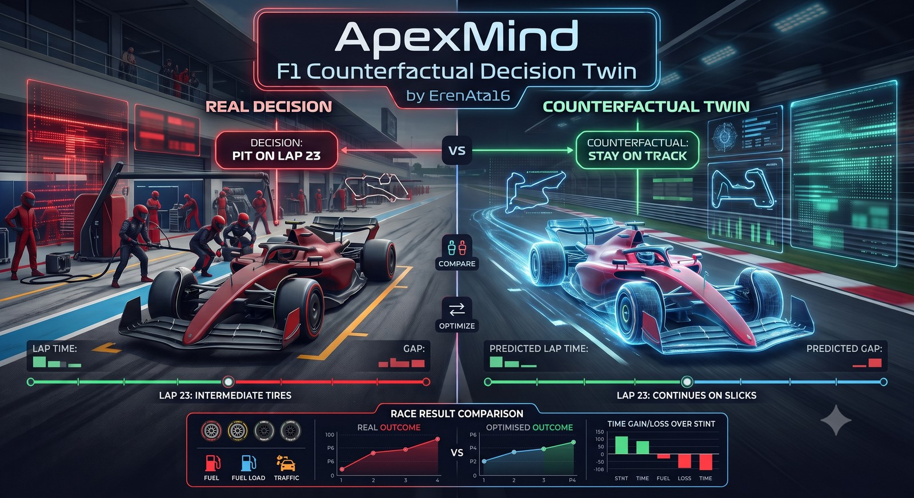
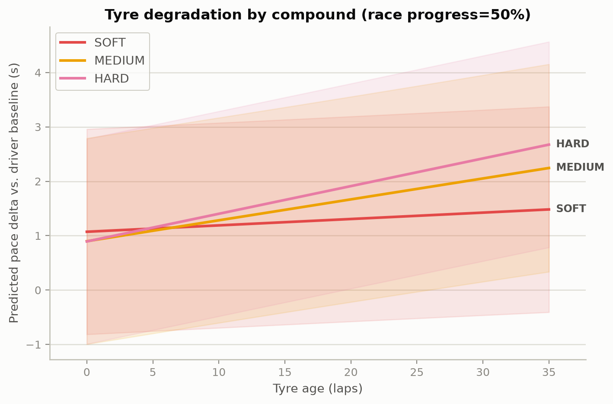
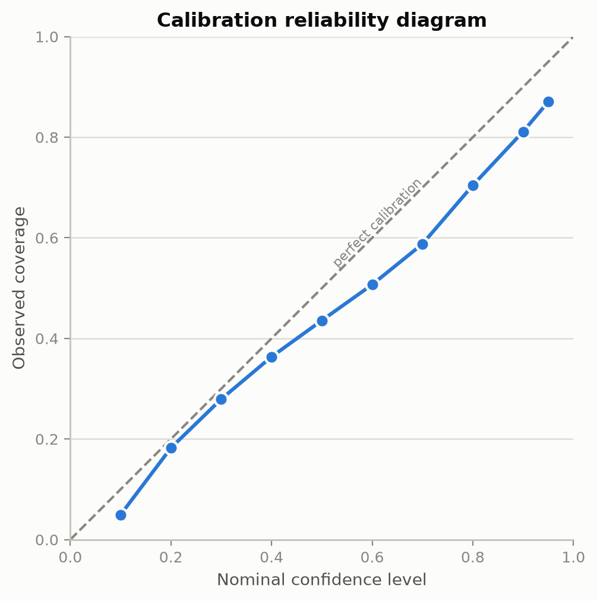
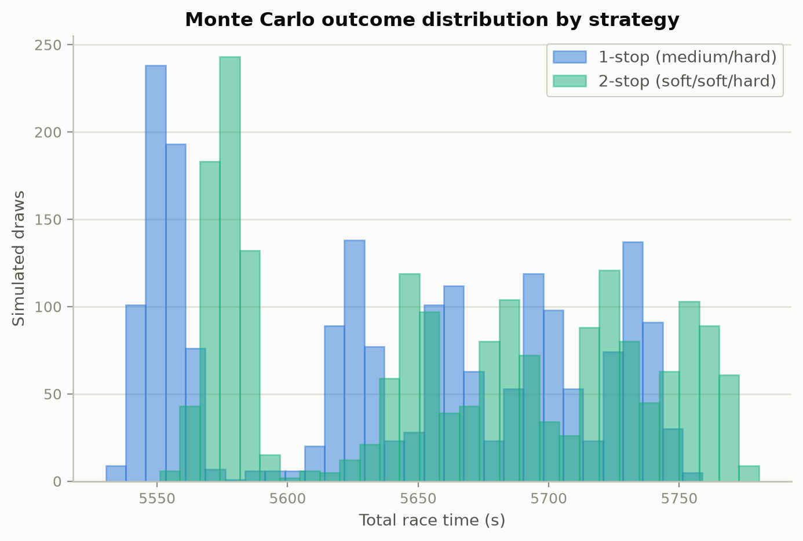

<p align="center">
  
</p>
<p align="center"><sub>Concept illustration, not a data claim — the real, data-generated results are in the charts below and throughout this README.</sub></p>

# ApexMind: F1 Counterfactual Decision Twin

[](https://github.com/ErenAta16/f1-counterfactual-decision-twin/actions/workflows/tests.yml)
[](LICENSE)
[](pyproject.toml)

An offline research laboratory for analysing Formula 1 strategy decisions from public data. At a decision point, ApexMind compares counterfactual options such as *pit now*, *extend the stint*, and *protect track position* under explicit assumptions, uncertainty, and FIA-rule constraints — and shows its work: every number traces back to a real lap, a fitted model, or a stated assumption.

> Status: **Phases 0-5 implemented for v1 scope (data fidelity, predictive foundation, counterfactual simulator, constrained decision engine, evidence interface). See `docs/TECHNICAL_REPORT.md` for the consolidated results and an independent reproducibility checklist.**

<p align="center">
  <picture>
    <source media="(prefers-color-scheme: dark)" srcset="docs/images/tyre-degradation-dark.png">
    
  </picture>
  <picture>
    <source media="(prefers-color-scheme: dark)" srcset="docs/images/calibration-reliability-dark.png">
    
  </picture>
  <picture>
    <source media="(prefers-color-scheme: dark)" srcset="docs/images/monte-carlo-outcomes-dark.png">
    
  </picture>
</p>
<p align="center"><sub>All three charts are generated from real ingested race data by <code>apexmind plot</code> — nothing here is a mock-up. Colours are validated for colour-vision-deficiency separation in both themes, not hand-picked.</sub></p>

## Why this project

Real F1 teams run hundreds of millions of Monte Carlo simulations before a race and re-decide in well under a minute on the pit wall — but none of that is public, reproducible, or checkable. This project asks a narrower, answerable question instead: starting only from public timing data and the published regulations, how far can an offline, fully auditable version of that same pipeline — Bayesian pace modelling, Monte Carlo simulation, constrained optimisation, cited explanation — actually get, and where exactly does it stop being trustworthy?

## The honest boundary

This is not a live pit-wall tool and it does not claim access to team telemetry. Public data does not expose a car's true battery state, power-unit maps, tyre temperatures, or active-aero state. ApexMind labels every input as **observed**, **inferred**, or **simulated** and reports conditional rather than absolute recommendations.

## Quickstart

```powershell
python -m venv .venv
.\.venv\Scripts\python.exe -m pip install -e ".[dev,viz]"
.\.venv\Scripts\python.exe -m pytest -q          # 139 tests, no network required

.\.venv\Scripts\apexmind.exe ingest --benchmark all --data-dir D:\apexmind-data
.\.venv\Scripts\apexmind.exe decide --reference-benchmark bahrain-2024 --data-dir D:\apexmind-data
.\.venv\Scripts\apexmind.exe plot --reference-benchmark bahrain-2024 --data-dir D:\apexmind-data
```

`decide` is the fastest way to see the whole pipeline (pace model,
simulator, and legal-strategy search) produce a real result, and
`plot` turns that pipeline's output into the three charts above for
your own data. Generating a cited natural-language explanation
(`apexmind explain`) additionally needs a Cohere API key — copy
`.env.example` to `.env` and fill it in, or set `COHERE_API_KEY` as an
environment variable; `.env` is git-ignored and the key is never
committed. The full command reference and a numbered, independently
reproducible verification checklist are in
[`docs/TECHNICAL_REPORT.md`](docs/TECHNICAL_REPORT.md).

Prefer working from Python or a notebook? `from apexmind import get_benchmark, fit_bayesian_pace_model, optimise_strategies` — see [`src/apexmind/__init__.py`](src/apexmind/__init__.py) for the full curated surface.

## Repository map

- [`docs/PROJECT_PLAN.md`](docs/PROJECT_PLAN.md) — scope, architecture, risks, and evaluation protocol
- [`docs/ROADMAP.md`](docs/ROADMAP.md) — gated delivery plan and backlog
- [`docs/progress/00-inception.md`](docs/progress/00-inception.md) — initial project record
- [`CONTRIBUTING.md`](CONTRIBUTING.md) — setup, PR expectations, and good-first-issue candidates

## Near-term milestone

Phases 1-5 are complete for v1 scope: a reproducible replay of three historical races, a validated tyre-and-pace model, a counterfactual race simulator, a constrained strategy optimiser with one encoded FIA regulation, and a cited, evidence-grounded explanation and replay interface verified against a real language model API. What remains open is named explicitly in `docs/TECHNICAL_REPORT.md` rather than implied to be finished.

The initial data-fidelity work, benchmark rationale, source caveats, and the normalised lap-state schema are recorded in [`docs/DATA_FOUNDATION.md`](docs/DATA_FOUNDATION.md).

The pace/tyre model, its baselines, and its current calibration gap are recorded in [`docs/PACE_MODEL.md`](docs/PACE_MODEL.md).

The counterfactual race simulator, its declared Safety Car scenario, and its scope limits are recorded in [`docs/SIMULATOR.md`](docs/SIMULATOR.md).

The constrained decision engine, its one encoded FIA regulation, and the pace-model limitation its optimiser surfaced are recorded in [`docs/DECISION_ENGINE.md`](docs/DECISION_ENGINE.md).

The evidence interface — cited, evidence-grounded explanation generation, its model choice, and what is still missing — is recorded in [`docs/EVIDENCE_INTERFACE.md`](docs/EVIDENCE_INTERFACE.md).

A consolidated summary of every phase, what is honestly still unresolved, and a step-by-step reproducibility checklist are in [`docs/TECHNICAL_REPORT.md`](docs/TECHNICAL_REPORT.md).

## Related work

A few other projects sit in the same space, worth knowing about rather than ignoring:

- **[FastF1](https://github.com/theOehrly/Fast-F1)** is the timing/telemetry access layer this project is built on, not a competitor — most of the F1 open-source ecosystem, including this project, exists because it does.
- **[TUMFTM/race-simulation](https://github.com/TUMFTM/race-simulation)** (TU Munich) is an academically published Monte Carlo race-strategy simulator with a reinforcement-learning "Virtual Strategy Engineer." It solves a broader problem — full-field, multi-car races — than this project's single-car counterfactual scope.
- **[F1 StratLab](https://github.com/VforVitorio/F1-StratLab)** is a multi-agent system (seven ML models, six coordinated agents) aimed at live strategy recommendations from real-time telemetry, radio, and a RAG-based regulation lookup.
- A 2026 paper, *Pitwall: Verified Natural-Language Race-Strategy Briefings*, describes a live-deployed system combining a calibrated Monte Carlo engine with verifier-gated language generation — conceptually close to this project's evidence interface, though built for live deployment with a fine-tuned model rather than as an offline, reproducible reference.

Where this project differs deliberately: everything here runs from a clean checkout with no GPU, no fine-tuning pipeline, and no vector database. Regulation grounding is a hand-curated citation with a SHA-256 hash of the source PDF and the exact article quoted (`docs/regulations/tyre-compound-rule.md`), not retrieval over an embedding index — slower to extend, but every citation can be checked by opening the source document yourself.

## Data and attribution

The initial research data sources are OpenF1, FastF1, and publicly available FIA regulations. Use is offline and research-oriented; source terms must be re-checked before any public deployment or commercial use. The project is independent and has no affiliation with Formula 1, the FIA, Aston Martin Aramco Formula One Team, or Cohere.

## Licence

MIT. See [`LICENSE`](LICENSE).
